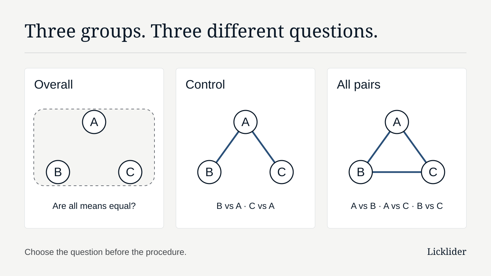

# What to decide before asking an agent to compare several groups

Specify the comparisons, research conditions, and outputs you need so an agent can propose an analysis that answers your question.

<figure>
  
  <figcaption>The same three groups can support different questions. Lines identify requested comparisons; they do not represent observed differences.</figcaption>
</figure>

You have measurements from a control group and two treatment groups. You want help analysing them, so you ask an AI agent: “Compare the three groups and tell me which differ.”

Before calculating, the agent needs to know what comparison would answer your research question. Do you want evidence of any difference among the population means? A comparison of each treatment with the control? Or a comparison of every pair, including the two treatments?

A useful first request makes those choices visible. It can leave the method open for discussion while giving the agent enough context to propose one. Here is how to write that request, using a hypothetical three-group experiment.

## Start with the question the result should answer

Call the control A and the two treatments B and C. For this example, the outcome is a continuous measurement and the quantities of interest are population means.

| Your question | What to ask the analysis to address | What that request leaves open |
| --- | --- | --- |
| Is there evidence that the three population means are not all equal? | An overall test of equality of the three means | Which particular means differ |
| Does either treatment differ from the prespecified control? | B versus A and C versus A | The difference between B and C |
| Which groups differ from one another? | A versus B, A versus C, and B versus C | Whether a difference matters for the research question |

An overall test addresses a joint hypothesis. Its rejection does not, by itself, identify a particular differing pair. The [NIST explanation of multiple comparisons](https://www.itl.nist.gov/div898/handbook/prc/section4/prc47.htm) describes this distinction. Our [investigation of multiple-comparison guarantees](https://www.licklider.ai/engineering/what-multiple-comparison-procedures-guarantee/#comparisons) explains why “ANOVA followed by comparisons” still leaves the pairwise error guarantee unspecified.

The reference group also matters. A control chosen before seeing results has a different role from the group with the largest observed mean. Our [review of control and best-treatment comparisons](https://www.licklider.ai/engineering/comparing-with-control-or-best/#question) preserves that distinction. If your goal is to select a treatment, explain what selection means rather than silently making the observed leader the control.

## Name the comparisons that belong together

For the control-focused question, write the comparison family explicitly: **B versus A and C versus A, for the named outcome and measurement time**. The family is the set of hypotheses being considered together for the stated error-control claim.

Then say what error criterion the analysis should address. Familywise error control concerns the probability of at least one false rejection in that family. False discovery rate concerns the expected proportion of false discoveries among rejections, with the proportion defined as zero when there are no rejections. These are different objectives. Our [method-name research note](https://www.licklider.ai/research/why-statistical-method-names-are-not-enough/#finding) explains why a procedure's name cannot substitute for its family, criterion, and conditions.

For the example below, we choose familywise error control for the two planned comparisons. That is an illustrative design choice, not a recommendation for every experiment. If you have not chosen the criterion or its level, ask the agent to explain the options and leave the choice unresolved.

Treat the family as part of the research question. Specify it before inspecting the comparison results where possible, and record when the question was chosen. If other outcomes, time points, or comparisons contribute to the same intended claim, discuss their relationship too. Calling two comparisons a family does not settle multiplicity for an entire study. The [NIST discussion of Bonferroni intervals](https://www.itl.nist.gov/div898/handbook/prc/section4/prc473.htm) illustrates how simultaneous coverage is attached to a specified set of statements.

## Give the agent the experimental meaning of a row

Alongside the question, provide the information needed to assess a proposed method: what was measured, its units and time point, what received the treatment, and whether observations are independent, paired, repeated, or grouped by a shared experimental unit. Explain how repeated measurements were summarised and identify missing values or exclusions.

A table of numbers cannot establish all of those facts. Label anything you have not checked as unknown and ask for a targeted question. Do not let a plausible description of an experiment become a declaration about what actually happened.

Method conditions still need attention after the comparisons are named. For example, the [SciPy documentation for its Dunnett implementation](https://docs.scipy.org/doc/scipy/reference/generated/scipy.stats.dunnett.html) states assumptions about independence, normality, and equal population variances. The request “compare with control” alone does not establish them or select that implementation.

## An example request to adapt

This is a constructed planning example, not a customer case or a tested prompt. Its experimental facts and choices are illustrative. Replace them with your actual design; retain an unknown when you cannot supply the answer.

> **Question.** We want to estimate how each of two treatments differs from control in mean outcome Y, measured in units U at time T. A is the control selected in the experiment's plan; B and C are treatments.
>
> **Observations.** Each row contains one measurement from a distinct experimental unit. Units were assigned to one group each; units are independent within and across groups, with no shared cluster, pairing, or repeated measurement. There are no missing outcomes or exclusions in this example. Group sample sizes are available in the attached data. Population distribution and variance assumptions have not yet been assessed.
>
> **Comparisons.** Our planned family is B minus A and C minus A for Y at T. We selected these comparisons before inspecting their results. We want two-sided comparisons. B versus C is outside this planned family; if it becomes a question, identify it as an additional analysis and explain the implications before proceeding.
>
> **Error criterion.** Propose an approach with strong familywise error control at 0.05 across these two comparisons, under explicitly stated conditions. Explain those conditions and any unresolved information. This level is our illustrative choice for this example.
>
> **Outputs.** Report estimated mean differences in units U, sample sizes, and adjusted p-values for the stated family. We also want simultaneous confidence intervals at a stated family coverage level of 95%. Identify the interval construction separately and explain whether its zero-exclusion decisions correspond to the reported tests. If the proposed procedure cannot supply these outputs with the requested properties, explain the gap.
>
> **Before calculating.** Restate the question and comparisons. Propose the exact procedure and implementation, identify the conditions requiring our confirmation, and ask about missing information. If a requested property is unavailable, propose an alternative with its changed scope. Do not quietly substitute a different family, direction, or error criterion.

Each part serves a different purpose. The question fixes the quantity of interest. The observations supply experimental context. The comparison list and error criterion define the intended testing claim. The output request makes interpretation inspectable. The final instruction gives uncertainty a useful next step.

“Strong” familywise control asks for the bound to hold even when some hypotheses in the family are false and others are true. That distinction, and the difference between a testing rule and an interval construction, are explained in our [guarantee review](https://www.licklider.ai/engineering/what-multiple-comparison-procedures-guarantee/#dependence) and [control-comparison review](https://www.licklider.ai/engineering/comparing-with-control-or-best/#control).

## Read the proposal against your request

When the agent replies, compare its proposal with the choices you supplied. Does it retain both treatment–control comparisons? Are the reported differences oriented as B minus A and C minus A? Does it name the conditions behind the claimed error control? Are the intervals simultaneous for the stated family, or individual intervals?

A response that gives only an overall p-value has left the control comparisons unanswered. A response that silently includes B versus C in the family used for adjustment has changed the request. A response that needs experimental information has identified a question for the researcher. Each calls for a different follow-up.

Once the proposal and its required conditions are settled, the calculation can proceed through an appropriate implementation. Keep the request, adopted method, implementation version, and output interpretation together so a collaborator can see what was decided.

This article offers a way to specify and discuss an analysis. It does not validate an experiment, choose a universally preferable method, or demonstrate that an AI agent will follow the request. It also makes no claim that nomue implements this multi-group workflow. The linked Licklider investigations supply bounded source distinctions; the request template is our practical synthesis of them.

Before your next multi-group analysis, write the comparisons in ordinary language and list the facts you still need to confirm. Give the agent that starting point, then judge its proposal against the question you actually want answered.
